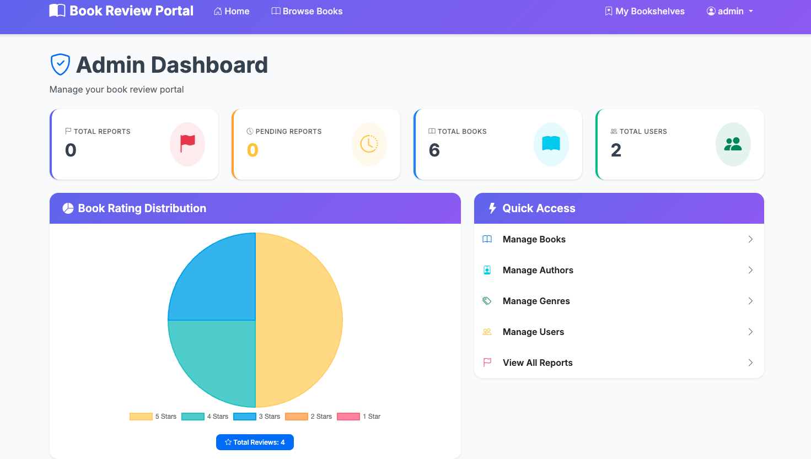
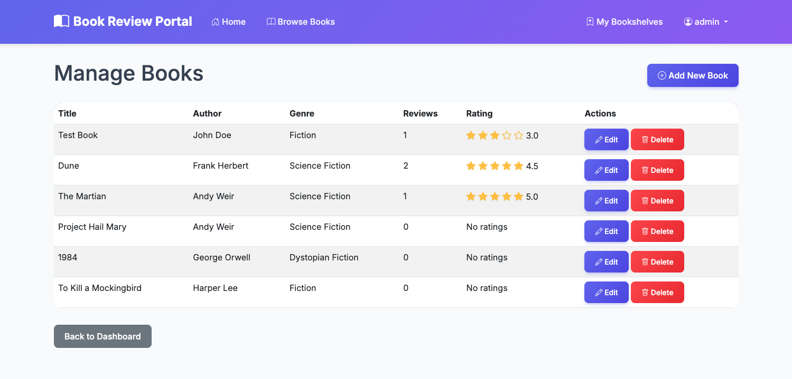

# Book Review Portal

A comprehensive book review platform built with Laravel, allowing users to discover, review, and organize books.

## Features

- **User Authentication**: Registration, login, and logout
- **Book Browsing**: Search books by title/author, browse by genre
- **Reviews**: Write, edit, and delete book reviews with star ratings
- **Bookshelves**: Organize books into "Want to Read", "Currently Reading", and "Read" shelves
- **User Profiles**: Public profiles showing reviews and bookshelves
- **Admin Dashboard**: Content moderation and report management
- **Reporting System**: Users can report inappropriate content

## Screenshots

> **Note:** Place your screenshot images in the `screenshots/` directory with the following filenames:
> - `homepage.png` - Homepage screenshot
> - `admin-dashboard.png` - Admin dashboard screenshot  
> - `manage-books.png` - Manage books page screenshot

### Homepage
The homepage features a modern hero section with gradient background, enhanced search functionality, genre browsing with rounded pill buttons, and displays top-rated and recently added books with beautiful card layouts featuring rating badges and hover effects.


### Admin Dashboard
The admin dashboard provides a comprehensive overview with modern statistics cards showing total reports, pending reports, total books, and total users. It includes a rating distribution pie chart and quick access menu to all management features.



### Manage Books
The book management interface allows administrators to view all books in a clean table format with ratings displayed as stars, reviews count, and quick edit/delete action buttons. The interface features a modern design with improved typography and spacing.



## Technology Stack

- **Backend**: PHP 7.4+ / Laravel 8
- **Database**: MySQL
- **Package Manager**: Composer
- **Frontend**: Bootstrap 5, Blade Templates

## Installation

### Prerequisites

- PHP 7.4 or higher
- Composer
- MySQL 5.7+ or MariaDB
- Node.js and NPM (optional, for asset compilation)

### Setup Steps

1. **Clone the repository** (if applicable) or navigate to the project directory

2. **Install dependencies**:
   ```bash
   composer install
   ```

3. **Create environment file**:
   ```bash
   cp .env.example .env
   ```

4. **Generate application key**:
   ```bash
   php artisan key:generate
   ```

5. **Configure database** in `.env`:
   ```env
   DB_CONNECTION=mysql
   DB_HOST=127.0.0.1
   DB_PORT=3306
   DB_DATABASE=book_review_portal
   DB_USERNAME=root
   DB_PASSWORD=your_password
   ```

6. **Run migrations**:
   ```bash
   php artisan migrate
   ```

7. **Seed the database** (optional, creates admin user and sample data):
   ```bash
   php artisan db:seed
   ```

8. **Start the development server**:
   ```bash
   php artisan serve
   ```

   The application will be available at `http://localhost:8000`

## Default Credentials (After Seeding)

- **Admin**: 
  - Email: `admin@bookreview.com`
  - Password: `password`

- **Member**: 
  - Email: `booklover@example.com`
  - Password: `password`

## Project Structure

```
book-review-portal/
├── app/
│   ├── Http/
│   │   ├── Controllers/     # Application controllers
│   │   └── Middleware/      # Custom middleware
│   └── Models/              # Eloquent models
├── database/
│   ├── migrations/          # Database migrations
│   └── seeders/             # Database seeders
├── resources/
│   └── views/               # Blade templates
├── routes/
│   └── web.php              # Web routes
└── config/                  # Configuration files
```

## Key Routes

- `/` - Homepage
- `/register` - User registration
- `/login` - User login
- `/books` - Browse all books
- `/books/{book}` - View book details
- `/books/genre/{genre}` - Browse by genre
- `/my-bookshelves` - User's bookshelves (auth required)
- `/profile/{user}` - User profile
- `/admin/dashboard` - Admin dashboard (admin only)

## User Roles

- **Guest**: Unregistered users can browse books and read reviews
- **Member**: Logged-in users can write reviews, manage bookshelves, and report content
- **Admin**: Administrators can moderate content, view reports, and manage the platform

## Database Schema

- **users**: User accounts with roles (member/admin)
- **books**: Book information
- **reviews**: User reviews for books
- **bookshelves**: User's book organization
- **reports**: Content moderation reports

## Development

### Running Tests
```bash
php artisan test
```

### Code Style
```bash
./vendor/bin/pint
```

## License

MIT License

## Contributing

Contributions are welcome! Please feel free to submit a Pull Request.

